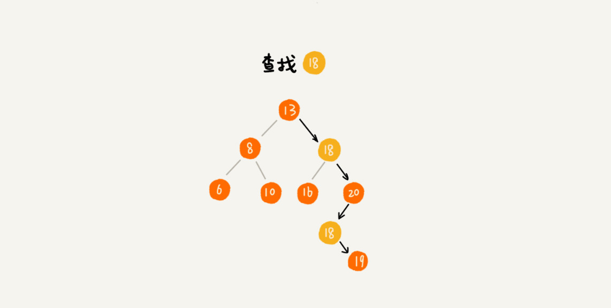

# 树
###
> 1.  线性表：栈、队列、数组、链表
> 2.  非线性表：树(二叉树，平衡树，红黑树)
---
## 树的相关属性


>在我们的生活中:
- “高度”这个概念，其实就是从下往上度量，比如我们要度量第 10 层楼的高度、第 13 层楼的高度，起点都是地面。所以，树这种数据结构的高度也是一样，从最底层开始计数，并且计数的起点是 0。
- “深度”这个概念在生活中是从上往下度量的，比如水中鱼的深度，是从水平面开始度量的。所以，树这种数据结构的深度也是类似的，从根结点开始度量，并且计数起点也是 0。
- “层数”跟深度的计算类似，不过，计数起点是 1，也就是说根节点的位于第 1 层。

---

----
### 二叉树（Binary Tree）
> 树结构多种多样，不过我们最常用还是***二叉树***。
- 二叉树，顾名思义，每个节点最多有两个“叉”，也就是两个子节点，分别是左子节点和右子节点。不过，二叉树并不要求每个节点都有两个子节点，有的节点只有左子节点，有的节点只有右子节点。

---
- 其中，编号 2 的二叉树中，叶子节点全都在最底层，除了叶子节点之外，每个节点都有左右两个子节点，这种二叉树就叫作**满二叉树**。
- 编号 3 的二叉树中，叶子节点都在最底下两层，最后一层的叶子节点都靠左排列，并且除了最后一层，其他层的节点个数都要达到最大，这种二叉树叫作**完全二叉树**。

---
### 二叉树的遍历
> 经典的方法有三种，前序遍历、中序遍历和后序遍历。其中，前、中、后序，表示的是节点与它的左右子树节点遍历打印的先后顺序


- 1.前序遍历是指，对于树中的任意**节点**来说，先打印这个*节点*，然后再打印它的左子树，最后打印它的右子树。
>> 本身--左子树--右子树
- 2.中序遍历是指，对于树中的任意**节点**来说，先打印它的*左子树*，然后再打印它本身，最后打印它的右子树。
>> 左子树--本身--右子树
- 3.后序遍历是指，对于树中的任意**节点**来说，先打印它的*左子树*，然后再打印它的右子树，最后打印这个节点本身。
>> 本身--左子树--右子树

### 推导式
```
前序遍历的递推公式：
preOrder(r) = print r->preOrder(r->left)->preOrder(r->right)
中序遍历的递推公式：
inOrder(r) = inOrder(r->left)->print r->inOrder(r->right)
后序遍历的递推公式：
postOrder(r) = postOrder(r->left)->postOrder(r->right)->print r
```
###伪代码
```
void preOrder(Node* root) {
    if (root == null) return;
    print root // 此处为伪代码，表示打印 root 节点
    preOrder(root->left);
    preOrder(root->right);
}

void inOrder(Node* root) {
    if (root == null) return;
    inOrder(root->left);
    print root // 此处为伪代码，表示打印 root 节点
    inOrder(root->right);
}

void postOrder(Node* root) {
    if (root == null) return;
    postOrder(root->left);
    postOrder(root->right);
    print root // 此处为伪代码，表示打印 root 节点

}

```
---
---
---
> 二叉查找树最大的特点就是，支持动态数据集合的快速*插入*、*删除*、*查找*操作。
>> 散列表也是支持这些操作的，并且散列表的这些操作比二叉查找树更高效，时间复杂度是 O(1)。既然有了这么高效的散列表，使用二叉树的地方是不是都可以替换成散列表呢？有没有哪些地方是散列表做不了，必须要用二叉树来做的呢？

## 二叉查找树（Binary Search Tree）
-  >二叉查找树是二叉树中最常用的一种类型，也叫二叉搜索树。顾名思义，二叉查找树是为了实现快速查找而生的。不过，它不仅仅支持快速查找一个数据，还支持快速插入、删除一个数据。它是怎么做到这些的呢？
-  >这些都依赖于二叉查找树的特殊结构。二叉查找树要求，在树中的任意一个节点，其左子树中的每个节点的值，都要小于这个节点的值，而右子树节点的值都大于这个节点的值。如下图：
---

===
###二叉查找树的查找操作
- >首先，我们看如何在二叉查找树中查找一个节点。我们先取根节点，如果它等于我们要查找的数据，那就返回。如果要查找的数据比根节点的值小，那就在左子树中递归查找；如果要查找的数据比根节点的值大，那就在右子树中递归查找。
---

---
```
// 二叉树查找代码
public class BinarySearchTree {
    private Node tree;

    public Node find(int data) {
        Node p = tree;

        while (p != null) {
            if (data < p.data) {
                p = p.left;
            } else if (data > p.data) {
                p = p.right;
            } else {
                return p;
            }
        }
        return null;
    }


    public static class Node {
        private int data;
        private Node left;
        private Node right;

        public Node(int data) {
            this.data = data;
        }
    }
}

```
---
### 二叉查找树的插入操作
- > 二叉查找树的插入过程有点类似查找操作。新插入的数据一般都是在叶子节点上，所以我们只需要从根节点开始，依次比较要插入的数据和节点的大小关系。
如果要插入的数据比节点的数据大，并且节点的右子树为空，就将新数据直接插到右子节点的位置；如果不为空，就再递归遍历右子树，查找插入位置。同理，如果要插入的数据比节点数值小，并且节点的左子树为空，就将新数据插入到左子节点的位置；如果不为空，就再递归遍历左子树，查找插入位置。
---

---
```
// 二叉树的插入
    public void insert(int data) {
        if (tree == null) {
            tree = new Node(data);
            return;
        }

        Node p = tree;
        while (p != null) {
            if (data > p.data) {
                if (p.right == null) {
                    p.right = new Node(data);
                    return;
                }
                p = p.right;
            } else { // data < p.data
                if (p.left == null) {
                    p.left = new Node(data);
                    return;
                }
                p = p.left;
            }
        }
    }
```
---
### 二叉查找树的删除操作
> 二叉查找树的查找、插入操作都比较简单易懂，但是它的删除操作就比较复杂了 。针对要删除节点的子节点个数的不同，我们需要分三种情况来处理。
>> - 第一种情况是，如果要删除的节点没有子节点，我们只需要直接将父节点中，指向要删除节点的指针置为 null。比如图中的删除节点 55。
>> - 第二种情况是，如果要删除的节点只有一个子节点（只有左子节点或者右子节点），我们只需要更新父节点中，指向要删除节点的指针，让它指向要删除节点的子节点就可以了。比如图中的删除节点 13。
>> - 第三种情况是，如果要删除的节点有两个子节点，这就比较复杂了。我们需要找到这个节点的右子树中的最小节点，把它替换到要删除的节点上。然后再删除掉这个最小节点，因为最小节点肯定没有左子节点（如果有左子结点，那就不是最小节点了），所以，我们可以应用上面两条规则来删除这个最小节点。比如图中的删除节点 18。
---

---
```
    public void delete(int data) {
        // p 指向要删除的节点，初始化指向根节点
        Node p = tree;
        // pp 记录的是 p 的父节点
        Node pp = null;
        while (p != null && p.data != data) {
            pp = p;
            if (data > p.data) {
                p = p.right;
            } else {
                p = p.left;
            }
        }

        // 没有找到
        if (p == null) {
            return;
        }
        
        // 要删除的节点有两个子节点
        // 查找右子树中最小节点
        if (p.left != null && p.right != null) {
            Node minP = p.right;
            // minPP 表示 minP 的父节点
            Node minPP = p;

            while (minP.left != null) {
                minPP = minP;
                minP = minP.left;
            }

            // 将 minP 的数据替换到 p 中
            p.data = minP.data;
            // 下面就变成了删除 minP 了
            p = minP;
            pp = minPP;
        }

        // 删除节点是叶子节点或者仅有一个子节点
        // p 的子节点
        Node child;
        if (p.left != null) {
            child = p.left;
        } else if (p.right != null) {
            child = p.right;
        } else {
            child = null;
        }


        if (pp == null) {
            // 删除的是根节点
            tree = child;
        } else if (pp.left == p) {
            pp.left = child;
        } else {
            pp.right = child;
        }
    }
```
---
> 实际上，关于二叉查找树的删除操作，还有个非常简单、取巧的方法，就是单纯将要删除的节点标记为“已删除”，但是并不真正从树中将这个节点去掉。这样原本删除的节点还需要存储在内存中，比较浪费内存空间，但是删除操作就变得简单了很多。而且，这种处理方法也并没有增加插入、查找操作代码实现的难度。
---
###支持重复数据的二叉查找树
> 前面讲二叉查找树的时候，我们默认树中节点存储的都是数字。很多时候，在实际的软件开发中，我们在二叉查找树中存储的，是一个包含很多字段的对象。我们利用对象的某个字段作为键值（key）来构建二叉查找树。我们把对象中的其他字段叫作卫星数据。
前面我们讲的二叉查找树的操作，针对的都是不存在键值相同的情况。那如果存储的两个对象键值相同，这种情况该怎么处理呢？我这里有两种解决方法。
>> - 第一种方法比较容易。二叉查找树中每一个节点不仅会存储一个数据，因此我们通过链表和支持动态扩容的数组等数据结构，把值相同的数据都存储在同一个节点上。
>> - 第二种方法比较不好理解，不过更加优雅。每个节点仍然只存储一个数据。在查找插入位置的过程中，如果碰到一个节点的值，与要插入数据的值相同，我们就将这个要插入的数据放到这个节点的右子树，也就是说，把这个新插入的数据当作大于这个节点的值来处理。
---

---
> 当要查找数据的时候，遇到值相同的节点，我们并不停止查找操作，而是继续在右子树中查找，直到遇到叶子节点，才停止。这样就可以把键值等于要查找值的所有节点都找出来。
---

---
> 对于删除操作，我们也需要先查找到每个要删除的节点，然后再按前面讲的删除操作的方法，依次删除。
---

---
### 哈希表和二叉树的比较

> 我们在散列表那节中讲过，散列表的插入、删除、查找操作的时间复杂度可以做到常量级的 O(1)，非常高效。而二叉查找树在比较平衡的情况下，插入、删除、查找操作时间复杂度才是 O(logn)，相对散列表，好像并没有什么优势，那我们为什么还要用二叉查找树呢？
我认为有下面几个原因：
> - 第一，散列表中的数据是无序存储的，如果要输出有序的数据，需要先进行排序。而对于二叉查找树来说，我们只需要中序遍历，就可以在 O(n) 的时间复杂度内，输出有序的数据序列。
> - 第二，散列表扩容耗时很多，而且当遇到散列冲突时，性能不稳定，尽管二叉查找树的性能不稳定，但是在工程中，我们最常用的平衡二叉查找树的性能非常稳定，时间复杂度稳定在 O(logn)。
> - 第三，笼统地来说，尽管散列表的查找等操作的时间复杂度是常量级的，但因为哈希冲突的存在，这个常量不一定比 logn 小，所以实际的查找速度可能不一定比 O(logn) 快。加上哈希函数的耗时，也不一定就比平衡二叉查找树的效率高。
> - 第四，散列表的构造比二叉查找树要复杂，需要考虑的东西很多。比如散列函数的设计、冲突解决办法、扩容、缩容等。平衡二叉查找树只需要考虑平衡性这一个问题，而且这个问题的解决方案比较成熟、固定。
> - 最后，为了避免过多的散列冲突，散列表装载因子不能太大，特别是基于开放寻址法解决冲突的散列表，不然会浪费一定的存储空间。
---

## 红黑树
> 红黑树的起源，自然是二叉查找树了，这种树结构从根节点开始，左子节点小于它，右子节点大于它。每个节点都符合这个特性，所以易于查找，是一种很好的数据结构。但是它有一个问题，就是容易偏向某一侧，这样就像一个链表结构了，失去了树结构的优点，查找时间会变坏。
---
```
红黑树定义和性质
红黑树是一种含有红黑结点并能自平衡的二叉查找树。它必须满足下面性质：

    性质1：每个节点要么是黑色，要么是红色。
    性质2：根节点是黑色。
    性质3：每个叶子节点（NIL）是黑色。
    性质4：每个红色结点的两个子结点一定都是黑色。
    性质5：任意一结点到每个叶子结点的路径都包含数量相同的黑结点。
从性质5又可以推出：

性质5.1：如果一个结点存在黑子结点，那么该结点肯定有两个子结点

红黑树并不是一个完美平衡二叉查找树，从图1可以看到，
根结点P的左子树显然比右子树高，但左子树和右子树的黑结点的层数是相等的，
也即任意一个结点到到每个叶子结点的路径都包含数量相同的黑结点(性质5)。
所以我们叫红黑树这种平衡为 #黑色完美平衡#


```
[红黑树链接1](https://www.jianshu.com/p/e136ec79235c)

[红黑树链接2](https://www.cnblogs.com/tiancai/p/9072813.html)

### 比较
> 动态数据结构还包括以下几种：
```
1.链表：
    优势：高效地数据插入、删除。
    缺点：随机查找元素效率较低。
    适用场景：适用于顺序访问数据，数据维护较频繁的场合。

2.哈希链表
    优势：高效地数据插入、删除、随机查找元素。
    缺点：需要设计一个好的散列函数，把元素均匀分散到散列表中。
    适用场景：适用于在海量数据中随机访问数据的场合。

3.跳表
    优势：高效地查找、插入、删除数据。
    缺点：需要额外的空间来构建索引链表
    适用场景：适用于需要高效查找数据的场合。

4.二叉查找树
    优势：高效地查找、插入、删除数据，实现简单。
    缺点：需要动态地维护左右子树的高度平衡，否则数据查找会退化成链表的顺序查找。
    适用场景：适用于需要高效查找数据的场合。

```

