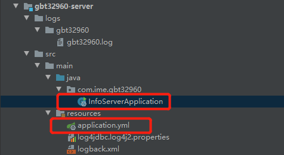
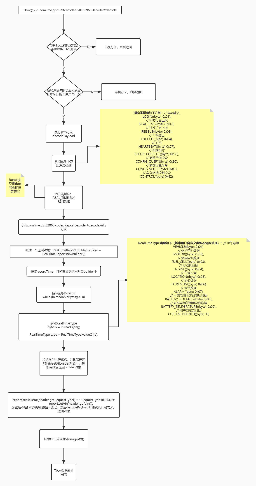
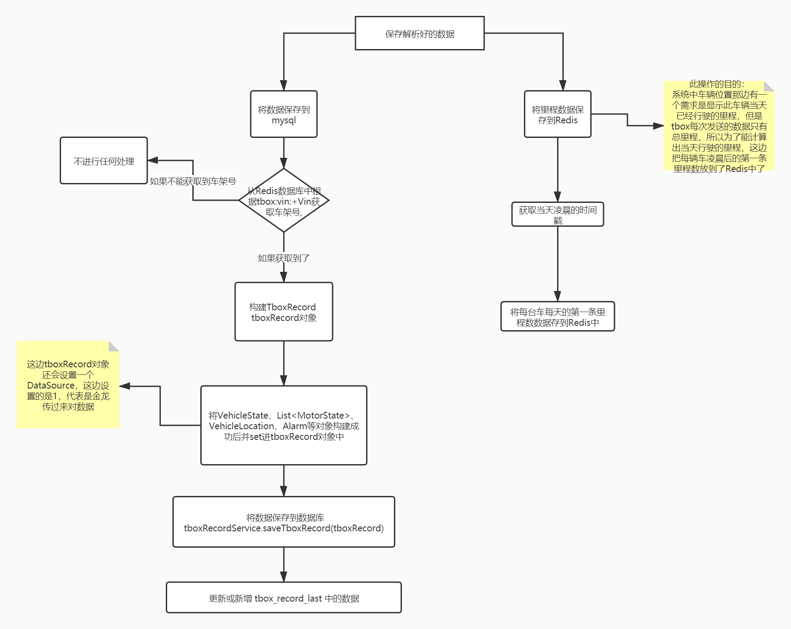
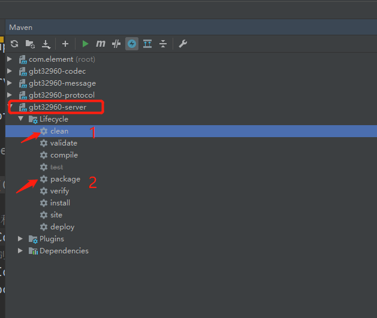

# GBT32960项目

## 项目结构
```aidl

32960 
├─gbt32960-codec            接收到消息进行编解码*      
├─gbt32960-message          定义消息的结构
├─gbt32960-protocol         协议处理器
├─gbt32960-server           项目的启动入口
```
---

## gbt32960-server
    此模块是项目的启动入口，配置了服务的端口，编码器和解码器，还有数据源等信息。


一个是数据源，一个是启动类

---
```aidl
启动类：
public class InfoServerApplication implements CommandLineRunner {
    // 服务端的端口
    private static final int LISTEN_PORT = 18831;
    // 目前此服务放在 115.29.66.131服务器上，所以此服务的完整路径就是：115.29.66.131：18831   

    public static void main(String[] args) {
        SpringApplication.run(InfoServerApplication.class);
    }

    @Override
    public void run(String... args) throws Exception {
        //NioEventLoopGroup是用来处理IO操作的多线程事件循环器
        //boss用来接收进来的连接
        EventLoopGroup bossGroup = new NioEventLoopGroup();
        //用来处理已经被接收的连接
        EventLoopGroup workerGroup = new NioEventLoopGroup();

        try {
            //是一个启动NIO服务的辅助启动类
            ServerBootstrap serverBootstrap = new ServerBootstrap();
            //为bootstrap设置acceptor的EventLoopGroup和client的EventLoopGroup
            //这些EventLoopGroups用于处理所有的IO事件
            serverBootstrap.group(bossGroup, workerGroup);
            // 通讯的通道，发送接受数据
            serverBootstrap.channel(NioServerSocketChannel.class);

            Bootstrap clientBoot = new Bootstrap();
            clientBoot.group(workerGroup);
            // 指定通道初始化器用来加载当Channel收到事件消息后，
            // 如何进行业务处理
            serverBootstrap.childHandler(new ChannelInitializer<SocketChannel>() {
                @Override
                protected void initChannel(SocketChannel ch) throws Exception {
                    ch.pipeline()
                            //设置一个编码器和解码器
                            .addLast(new CombinedChannelDuplexHandler<>(new GBT32960Decoder(), new GBT32960Encoder()))
                            // Netty心跳机制
                            .addLast(new IdleStateHandler(60 * 5, 0, 0))
                            .addLast(ProtocolHandler.getInstance());
                }
            });

            // BACKLOG用于构造服务端套接字ServerSocket对象，标识当服务器请求处理线程全满时，
            // 用于临时存放已完成三次握手的请求的队列的最大长度。如果未设置或所设置的值小于1，Java将使用默认值50。
            serverBootstrap.option(ChannelOption.SO_BACKLOG, 1024);

            // 绑定端口,开始接收进来的连接
            ChannelFuture f = serverBootstrap.bind(LISTEN_PORT).sync();
            log.info("server listened on {}", LISTEN_PORT);
            //关闭通道
            f.channel().closeFuture().sync();
        } finally {
            workerGroup.shutdownGracefully();
            bossGroup.shutdownGracefully();
        }
    }
}
```
---

```aidl
数据源的一些配置信息：
spring:
  data:
  redis:
    database: 0
    host: 47.103.67.236
    port: 10379
    password: xxxx
    timeout: 6000  # 连接超时时长（毫秒）
    jedis:
      pool:
        max-active: 1000  # 连接池最大连接数（使用负值表示没有限制）（毫秒）
        max-wait: -1      # 连接池最大阻塞等待时间（使用负值表示没有限制）（毫秒）
        max-idle: 10      # 连接池中的最大空闲连接
        min-idle: 5       # 连接池中的最小空闲连接
  datasource:
    druid:
      type: com.alibaba.druid.pool.DruidDataSource
      driverClassName: net.sf.log4jdbc.sql.jdbcapi.DriverSpy
      url: jdbc:log4jdbc:mysql://wlan-test01-jk-car.mysql.rds.aliyuncs.com:3306/vehicle_platform_db?serverTimezone=Asia/Shanghai&characterEncoding=utf8&useSSL=false
      username: prod_db_user
      password: xxx
```

---
## gbt32960-message
    此模块主要是定义接收tbox发送过来的数据格式，采用的序列化方法是谷歌的proto3，用此序列化可以跨平台，并且
    比Java自带的序列化要轻量、快。
 [proto3入门](https://www.jianshu.com/p/f6ff6381a81a)
 
 ---
 ## gbt32960-protocol
 协议处理器
 ### 主要方法：
    1、com.ime.gbt32960.protocol.ProtocolHandler#channelRead 
    接收到tbox消息，从消息中取出头信息，然后根据消息类型进行消息的分别处理。
    主要分为：LOGIN，HEARTBEAT，CLOCK_CORRECT这三种情况
      
    2、com.ime.gbt32960.protocol.ProtocolHandler#channelReadComplete
    消息读取完成要执行的方法
       
    3、com.ime.gbt32960.protocol.ProtocolHandler#channelActive  
    客户端连接上服务器会执行的方法

    4、com.ime.gbt32960.protocol.ProtocolHandler#channelInactive   
    客户端掉线执行的方法
    
    5、com.ime.gbt32960.protocol.ProtocolHandler#exceptionCaught  
    客户端出现异常是执行的方法，主要是关闭通道
    
---
## gbt32960-codec

com.ime.iov.gbt32960，这边的代码是通过protocol生成的，不需要修改，也不能修改。

com.ime.gbt32960.tbox,这边的代码主要是和数据库交互的代码，包括实体，DTO，mybatis的接口，service

com.ime.gbt32960.codec，这边的的代码是重点，主要是对接收到的数据进行编解码处理。然后提取我们需要的数据进行
封装然后保存到数据库。

tbox数据解析：


---
将数据保存到MySQL和Redis：


---

项目打包

服务器地址以及jar包存放的路径 见 “服务器登录的用户名和登录文件/服务器登录文件”


