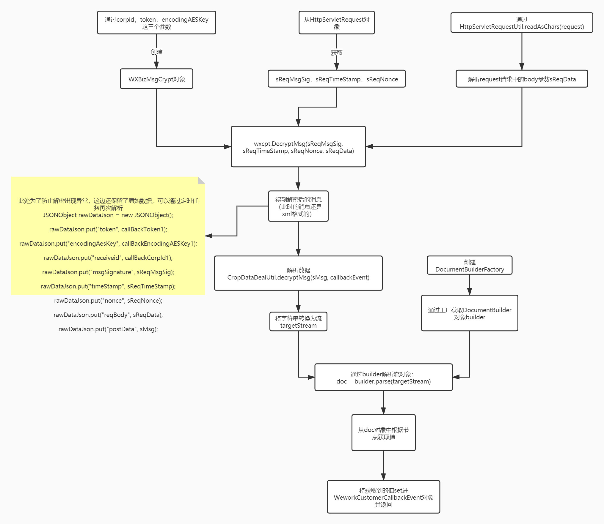

# 企业微信

## 企业微信接收变更事件
 路径：com.elementwin.wework.api.modules.customercallbackevent.controller.WeworkCustomerCallbackEventController#checkUrl
 参数：corpid，token，encodingAESKey 这三个参数是必需的，不能为空并且拼写不能写错
 微信加解密工具类：com.tencent.wework.chat.aes.WXBizMsgCrypt
--- 
## 处理回调返回的数据
 路径：com.elementwin.wework.api.modules.customercallbackevent.controller.WeworkCustomerCallbackEventController#dealCallBackData
 参数：corpid，token，encodingAESKey 这三个参数也是必需的，不能为空并且拼写不能出错
 
回调事件数据解析：

