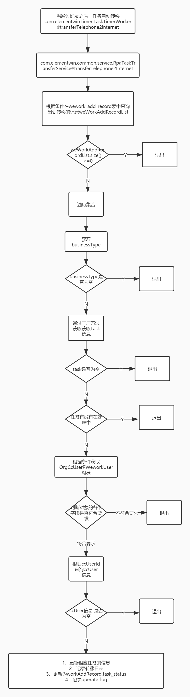

# 网销任务左侧列表

* 项目路径：com.elementwin.cc.controller.rest.presale.NewPresaleTaskRestController#internetTaskList
* 涉及到的表：org_cc_user_r_wework_user，wework_add_record，presale_task，cc_user，metadata_item
* 主要流程：

    1、获取当前cc_user_id，根据cc_user_id查询presale_task任务列表
    
    2、根据presale_task任务列表获取customerId列表
    
    3、根据customerIdList查询当天已经添加的记录集合，List<WeworkAddRecord> weworkAddRecordList
    
    4、根据weworkAddRecordList，封装左侧列表统计数量的查询对象，List<WeWorkLeftSideCountQuery> weWorkLeftSideCountQueryList，
        然后调用wework那边的接口，返回List<LeftSideWeWorkBackDTO> leftSideWeWorkBackDTOList集合
        调用wework的接口获取数量方法：com.elementwin.cc.service.impl.PresaleTaskServiceImpl#getLeftSideWeWorkBackList
    
    5、根据customerId集合和presaleTaskListRequest以及cc_user_id获取可执行的售前任务（这边查询的是视图），List<PresaleTaskVO> presaleTaskVOList
    
        方法地址：com.elementwin.cc.service.impl.PresaleTaskServiceImpl#findPresaleTaskList
    
    6、根据leftSideWeWorkBackDTOList将presaleTaskVOList数据分成3份（从未沟通，当日未沟通，当日已沟通），并统计相应的数量
    
        6.1、遍历presaleTaskVOList，将PassTime set进presaleTaskVO
        
        6.2、如果leftSideWeWorkBackDTOList的size小于0，那么 将任务全部放到从未沟通一列中
        
        6.3、根据wework放回的结构，先确认有没有聊天，如果没有聊天，将任务放到从未沟通这一tab中，如果有聊天再判断今天有没有聊天，
            如果今天有聊天，则将任务放到当日未沟通这一tab中，否则则放到当日未沟通tab中
        
        6.4、封装对象，排序、处理对象
    
    7、数据分配好后，然后将数据按相应的规则排序（从未沟通是按添加时间的倒序排，当日未沟通按价值等级排序，当日已沟通按“聊天的内容”），切分（每一个tab最多存在20条数据）
    
        排序工具：com.elementwin.cc.utils.PresaleTaskComparatorByItemValue、
        com.elementwin.cc.utils.PresaleTaskComparatorByDate、
        com.elementwin.cc.utils.PresaleTaskComparatorByPriority
        
        数据裁剪的方法：com.elementwin.cc.service.impl.PresaleTaskServiceImpl#subPresaleVOTask
        
---
# 任务转移

此操作是定时任务完成的,暂时是2分钟运行一次

* 项目路径：com.elementwin.timer.TaskTimerWorker#transferTelephone2Internet
* 涉及到的表：wework_add_record，presale_task，resell_task，revisit_task，org_cc_user_r_wework_user，cc_user，phone_to_internet_log，operate_log
* 主要流程：

    1、在wework_add_record表中查询出要转移的记录:weWorkAddRecordList，查询条件是：status = “CONFIRMED”，task_status = false
    
    2、遍历weWorkAddRecordList，然后处理转移逻辑和记录日志
    
    3、因为涉及到售前、售后和回访，为了使代码少一点if else判断，此处用了工厂方法，看代码的时候稍微注意一下
        工厂方法逻辑包位置：com.elementwin.common.service.abs
        
    4、获取passtime日期的17点时间
    
    5、检查该潜客是否在处理中，如果是处理中那么该任务就不能转移，代码执行到这边就停止；否则则继续往下执行
    
    6、在org_cc_user_r_wework_user表中查询出对应门店下的cc_user_id
    
    7、根据cc_user_id在cc_user_id表中查询ccUser对象
    
    8、更新对应task表的字段，包括cc_user_id，cc_org_id，follow_date，follow_deadline
    
    9、记录日志，即在phone_to_internet_log表中增加一条记录
    
    10、更新weWorkAddRecord的task_status字段状态，即将task_status字段的值更新成true
    
    11、保存operate_log
 
 流程图：   

        
        

