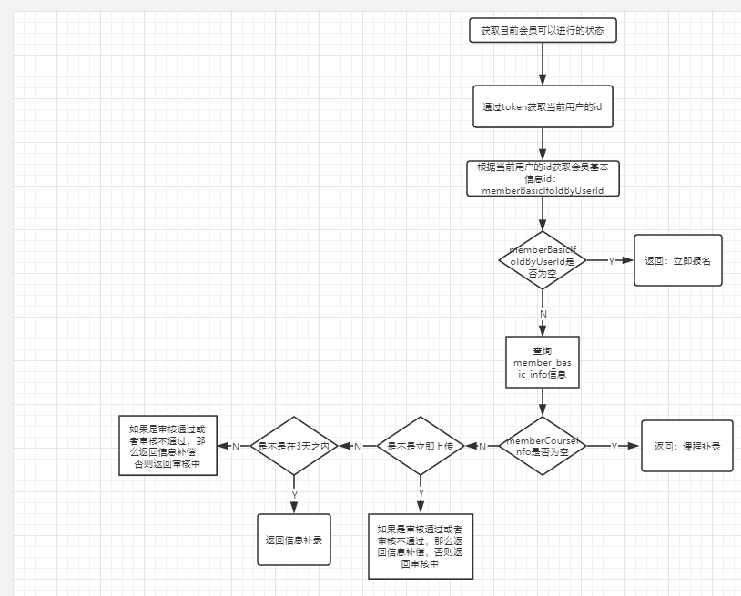

# 诺亚第健身

## 需要交接的模块
- 1、老会员回归模块
- 2、课程提交模块
- 3、视频兑换模块
- 4、积分兑换模块

---
### 老会员回归模块
* 项目路径：com.cnnyd.royalty.member.resource.MemberBackResource
* 涉及到的表：member_basic_info，member_course_info，member_course_info_detail，member_course_pic，sys_dictionary
* 主要的接口：
    
    1、根据手机号获取验证码：com.cnnyd.royalty.member.resource.MemberBackResource#getVerificationCode

    此方法先是从sys_dictionary字典表中查询出一个短息模板，然后调用CodeFactory.validCode()方法生成一个6位数的随机数，
    然后调用SendMsgByNydSend方法发送短信。方法路径：com.cnnyd.royalty.base.common.util.HttpClientsUtil#SendMsgByNydSend。
    这边可能会出现明明发送短信却收不到验证码的情况，这是可以联系短信供应商：移通，让他们查看是否该号码被放进了黑名单。
    
    2、校验用户的验证码：com.cnnyd.royalty.member.service.MemberService#checkCode
    
    此方法用来校验客户填写的验证码是否正确。这边的参数接收的是用户填写的和上个方法我们发给客户短信的，这个做的有点不好，后期可以优化下，
    将我们发给客户的验证码存到我们自己的数据库或者Redis中。
    
    3、老会员认证 上传个人照片：com.cnnyd.royalty.member.resource.MemberBackResource#uploadPicture
    
    此接口用来上传用户的头像，参数有file文件和上次上传的图片路径，这个路径是用来删除上次上传的图片的，上传的图片就放在服务器上，
    所以当客户更换图片时为了节约服务器空间，要把老的图片删除掉。此处将图片存在服务器做的也非常不好，代码维护非常困难，耦合性大，并且占用服务器资源，
    后期可以优化成将图片存放在七牛云或者阿里的FastDFS。
    
    4、保存会员回归基本信息：com.cnnyd.royalty.member.resource.MemberBackResource#save
    
    此方法的作用就是保存会员的基本信息。
    
    5、获取目前会员可以进行的状态：com.cnnyd.royalty.member.resource.MemberBackResource#getStatus
    
    
    
---
### 课程提交模块   
* 项目路径：com.cnnyd.royalty.member.resource.MemberCourseInfoResource、
com.cnnyd.royalty.member.resource.MemberCourseInfoDetailResource、
com.cnnyd.royalty.member.resource.MemberCoursePicResource
* 涉及到的表：member_course_info，member_course_info_detail，member_course_pic
* 主要的接口： 
    1、保存课程基本信息和详细信息：com.cnnyd.royalty.member.resource.MemberCourseInfoResource#saveBasicAndDetailInfo
    
    保存课程基本信息是将信息保存到member_course_info中，保存课程详细信息是将信息保存到member_course_info_detail中
    
    2、补录 会员历史课程详情信息：com.cnnyd.royalty.member.resource.MemberCourseInfoDetailResource#saveCourseInfoDetailAgain
    
    用于补录课程信息，补录的时候会过滤掉系统中已经存在的课程信息（课程名称相同则认为相同）
    
    3、获取当前用户的证书：com.cnnyd.royalty.member.resource.MemberCourseInfoDetailResource#getCertificateUrl
    
    此接口用来获取当前访问用户，他所有的证书信息。
    
    4、发送短信，提醒用户补充数据：com.cnnyd.royalty.member.resource.MemberCourseInfoResource#getMsg
    
    次方法用于提醒用户补交课程凭证。此方法会放在定时任务里执行，当用户提交课程信息的时候，课程凭证选择的是“稍后上传”，然后在截止日志最后
    半天的时候，就会触发此方法发送短信，一旦发送成功，就不会发送第二次。
    
    5、上传会员历史课程凭证照片：com.cnnyd.royalty.member.resource.MemberCoursePicResource#uploadPicture
    
    此方法用于上传用户的课程凭证的图片，此方法有两步操作，第一步将图片上传到服务器，第二步保存该图片也该会员的对应关系。和上传会员头像图片
    一样，后期可以把此方法统一用七牛云代替。
    
---
### 视频兑换模块
* 项目路径：com.cnnyd.royalty.member.resource.MemberVideoExchangeResource
* 涉及到的表：member_video，member_video_exchange，member_video_exchange_video
* 主要的接口：
    1、通过兑换码兑换视频：com.cnnyd.royalty.member.resource.MemberVideoExchangeResource#convertibleVideoByTicket
    
    首先获取该用户的兑换券信息，然后校验还有没有兑换次数，如果有兑换资格那么就将视频信息和会员信息存到member_video_exchange_video表中，
    然后将兑换次数减1。
    
    2、获取所有视频信息：com.cnnyd.royalty.member.resource.MemberVideoExchangeResource#getAllVideos
    
    此方法是查询到诺亚第那边上传的所有视频信息。返回视频信息的同时还会把该用户是否拥有该视频的标志（就是此用户是否兑换了此视频）
    一并返回给客户端，如果此视频用户已经拥有了那么他就可以播放视频，如果还没有拥有此视频，那么此时他可以兑换此视频。
    
    3、获取当前用户所兑换的视频信息：com.cnnyd.royalty.member.resource.MemberVideoExchangeResource#getCurrentUserVideos
    
    此方法是获取该用户所有已经兑换过的视频信息。
    
---

### 积分兑换模块
* 项目路径：com.cnnyd.royalty.member.resource.MemberIntegralExchangeResource
* 涉及到的表：member_integral_exchange，sys_user_info
* 主要的接口：
    1、诺亚第礼包积分兑换：com.cnnyd.royalty.member.resource.MemberIntegralExchangeResource#convertibleVideoByTicket
    
    此接口用于老会员回归后，当他提交的课程经过后台审核成功后，给他增加相应的积分。
    
---
    
    

    
    

    
    
    
    
    
    
    
    
