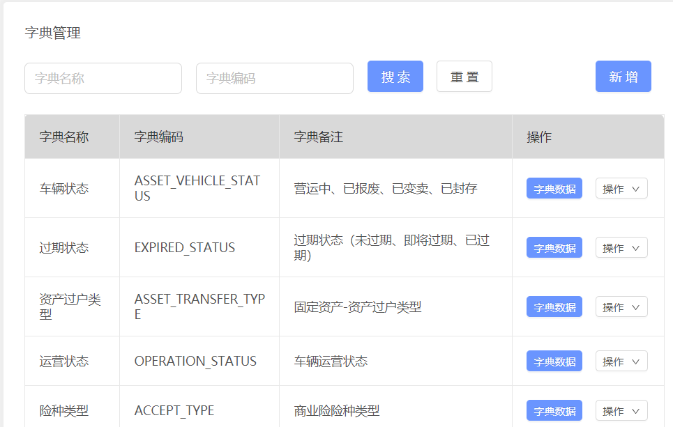
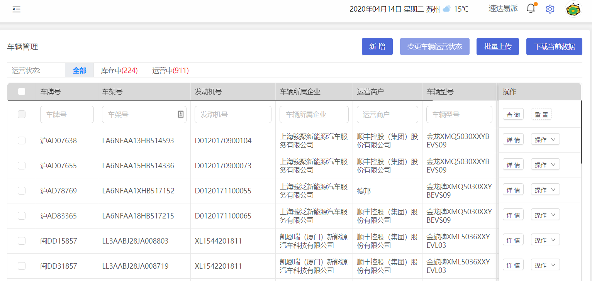
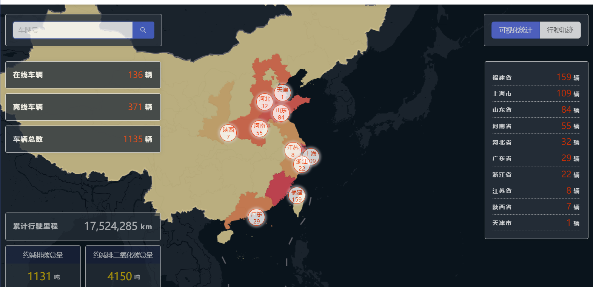
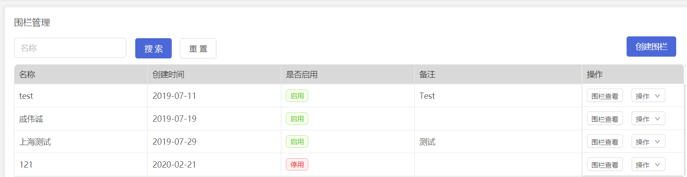
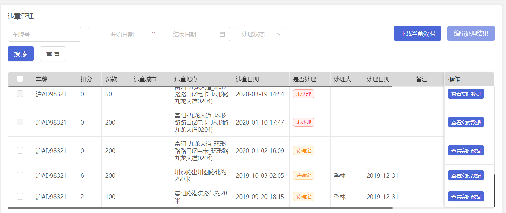
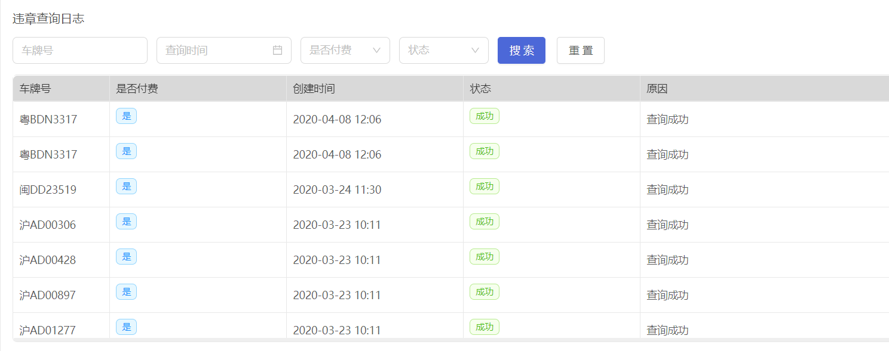

# vehicle-platform（车辆管理平台）

## 需要交接的模块
- 1、字典模块
- 2、车辆管理模块
- 3、地图模块（*）
- 4、违章查询模块（*）
- 5、tbox数据备份
---

***
## 字典模块
> * 项目路径：com.elementwin.dict
> 
> * 涉及到的表：dict、dict_data，dict和dict_data是一对多的关系，他们之间用code关联
>
>* 主要方法：基本的增删改查
>
> * 注意事项：
>> dict表中name和code不能为空，并且code需要唯一
>> dict_data表中的code客户端不传任何值会自动生成，默认是code_数字


---
## 车辆管理模块
> * 项目路径：com.elementwin.vehicleinfo
> * 涉及到的表：vehicle_basic_info
>* 主要方法：基本的增删改查，新增时会校验车辆的车架号，车架号在车辆表中是唯一的，新增
>车辆信息的时候还会生成这台车的一个二维码，生成的二维码图片存放在七牛云中，
>车辆转移，即将车辆从一个网店转移到另一个网点


---

## 地图模块
### 车辆位置，轨迹
> * 项目路径：com.elementwin.tbox.controller.TboxMessageController
> * 涉及到的表：tbox_record、tbox_record_last
>* 主要方法：
>> 1、根据车牌和时间段获取车辆轨迹（com.elementwin.tbox.controller.TboxMessageController#getLocation）
>此方法会根据车牌和时间段，在tbox_record表中查询该车辆的轨迹，并且如果此车辆如果配置
>围栏，那么围栏也会查出来返回给客户端
>>
>> 2、获取车辆实时位置（com.elementwin.tbox.controller.TboxMessageController#getRealTimeLocation）
>>此方法会查询出符合客户端传过来条件的所有车辆的实时位置，因为此处要查询的数据较多，
>并且有很多计算，为了加快查询速度，此处使用了线程池查询，线程池查询的方法地址为：
>com.elementwin.tbox.service.impl.RedisQuery，此方法中还有计算车辆是否离线的逻辑
>com.elementwin.tbox.utils.MapTools中有根据坐标判断车辆是否超出围栏的方法
>> 3、根据车架号获取车辆实时位置的详细信息（com.elementwin.tbox.controller.TboxMessageController#getLocationDetailByPlate）
>此方法用于查询车辆当天的里程，详细地址，电量等信息
>> 4、tbox_record_last表中分页查询终端数据（com.elementwin.tbox.controller.TboxMessageController#getTboxDataList）
>> 5、导出终端数据（com.elementwin.tbox.controller.TboxMessageController#exportTerminalData）
>> 6、以省为维度，显示各省车辆数（com.elementwin.tbox.controller.TboxMessageController#statisticsVehicleProvince）
>此方法是用来统计各个省的车辆情况
>> 7、获取该省份下车辆的实时位置信息（com.elementwin.tbox.controller.TboxMessageController#getRealTimeLocationByProvince）
>> 8、统计车辆各种状态的数量（com.elementwin.tbox.controller.TboxMessageController#statisticsStatusNum）
>> 9、计算总里程（com.elementwin.tbox.controller.TboxMessageController#countTotalMileage）
>> 10、计算节油减排（com.elementwin.tbox.controller.TboxMessageController#savingOil）
>

### 地图围栏
> * 项目路径：com.elementwin.tbox.controller.EnclosureController
>* 主要方法：
>> 1、围栏的增删改查，以及车辆批量绑定围栏
>


---
### 接收合康数据
> * 项目路径：com.elementwin.tbox.controller.ReceiveTboxMessageController
>>* 主要方法：
>> 1、通过http请求接收合康tbox的数据
>> 2、向tbox发送开车锁车命令（此方法只能对合康的车辆有效）
---

## 违章查询模块
> * 项目路径：com.elementwin.violation.controller
> * 涉及的表：vio_vehicle_info、vio_query_log
> * 描述：此处主要是调用聚合数据的接口来查违章，查询到的违章信息存到vio_vehicle_info表中，
>查询日志存到vio_query_log表中
>
> [聚合数据网站地址](https://www.juhe.cn/login)
>
>* 主要方法：
>> 1、通过聚合数据提供的接口查询车辆违章信息（com.elementwin.violation.controller.VioVehicleInfoController#getVioRecords）
>>
>> 2、更新违章车辆 处理人和处理时间 信息(com.elementwin.violation.controller.VioVehicleInfoController#updateVioVehInfo)
>>
>> 3、导出违章记录（com.elementwin.violation.controller.VioVehicleInfoController#exportExcel）
>>
>> 4、根据车牌号码判断是否有违章未处理记录（com.elementwin.violation.controller.VioVehicleInfoController#getVioByLicense）
    
    违章查询时，调用聚合数据接口，当出现“网络错误”和“内部异常”异常时，系统会进行重试机制，重试次数为3次。
    车辆查询出的违章信息正常情况下会保存到vio_vehicle_info表中了，但是这边有一个判断，就是根据车辆id和日期判断在vio_vehicle_info数据库中存不存在这条数据了，
    存在了就不保存（同一辆车在同一时间一般不会出现两次同样的违章）；
    还有一个逻辑就是：假如同一台车在第一次查询的违章数据是10条，第二次查询的违章数据是8条，那么我们会找出在第一次中查询到的而在第二次中未查询到的违章数据，然后将这部分数据的状态设置为“待处理”
    
>
>>



---
## tbox数据备份
> * 项目路径：com.elementwin.databack.controller.DataBackController
> * 涉及的表：tbox_record
> * 描述：此处的作用是备份tbox_record表的数据，并且删除一些时间很久的数据，首先将最近两月的数据
>插入到新表中，然后删除30天之前的数据，其中备份的数据也是只保留两个月，备份的数据保存在
>tbox_record_back数据库中.
>此处备份为了效率，使用的是原生的SQL，因为经过调研，MySQLDump很慢。
>
>   目前备份的数据是放到另一个数据库的，数据库名称为：tbox_record_back
>   具体的配置文件以及数据备份的工具类地址为：com.elementwin.databack.util.CreateTableTool
---

## 常见问题分析
- 1 xxx车不在线：
```aidl
a、先查看我们数据库中vehicle_basic_info有没有这台车的数据，如果没有，那我们是不接收tbox数据的
b、查看数据是否完整，特别是车牌、车架号
c、查看Redis中vinAndPlate是否有值
d、让商家查看该车有没有在使用（没有使用，tbox不会发送数据）
```
- 2 违章查询查询的数据不准确
```aidl
这个是调用的聚合数据的接口，可以联系那边的工作人员，将数据更新上去
```
- 3 车辆实时位置查询很卡
```aidl
可以看一下服务器硬盘和内存的使用情况
df -h
free -h
```
